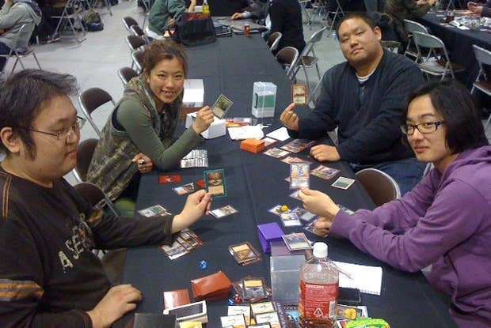

  

    

      

        
      

      

        
      

      

        
      

    

    <a class="carousel-control-prev" href="#eventCarousel" role="button" data-slide="prev">
      
      Previous
    </a>
    <a class="carousel-control-next" href="#eventCarousel" role="button" data-slide="next">
      
      Next
    </a>
  

  <h3 class="boldheader" style="margin-top:2rem">Upcoming Events</h3>
  

    

      

        

          
          

            <h5 class="card-title">Featured: </h5>
            
Event description preview

          

        

      

      

        

          
          

            <h5 class="card-title">Featured: </h5>
            
Event description preview

          

        

      

    

  

